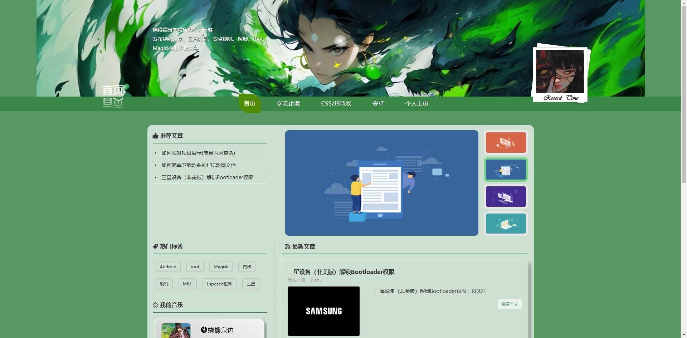
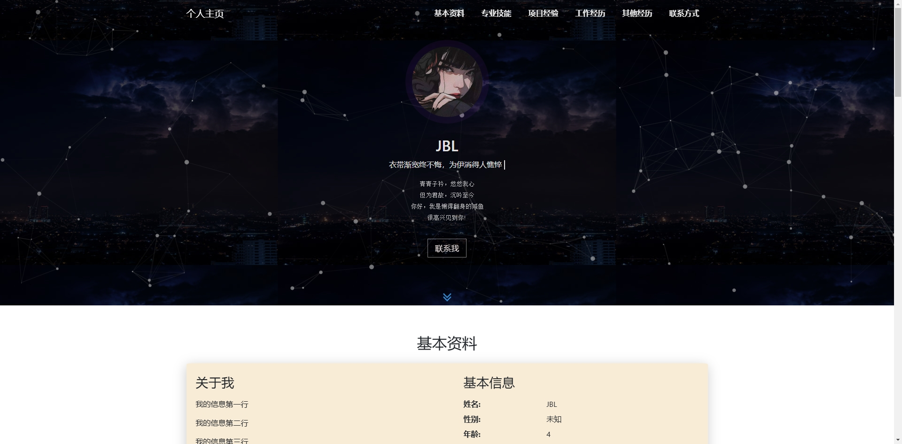
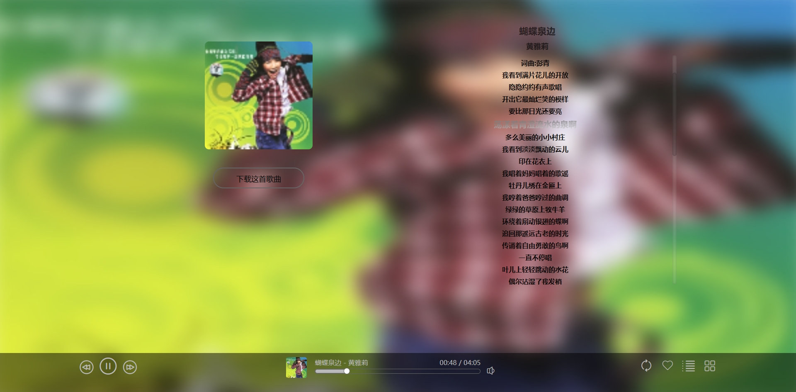
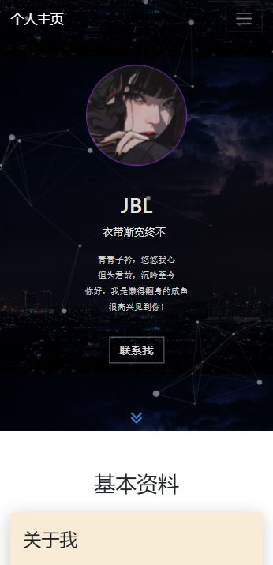
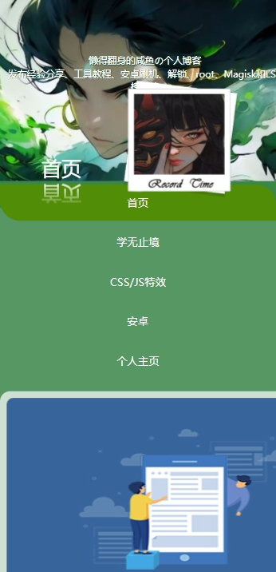

# 一个纯静态个人博客+个人主页的Web项目（废品）

## 项目背景

其实也没有啥背景，这么简单的东西，当时只是突发奇想，就做了一个，项目大量JS代码都是CV大佬的，纯纯裁缝一个。网站目前已上线jbl.xingmang.cloud，欢迎大家来访问。

## 所用技术：HTML、CSS、JavaScript

## 项目介绍

### 目前功能：

- 简单的用户交互（不是）
- 音乐播放器

### 未来将要开发的功能：

- 加入网易云音乐API支持，播放歌单音乐，不再是从网页静态加载

- 游客注册、登录、评论博客

- 动态博客

- 移动端页面适配

- 留言板

- More......

  （能不能完成啊，感觉要重做的样子）

## 项目截图

